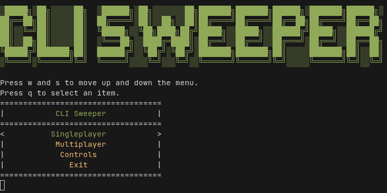
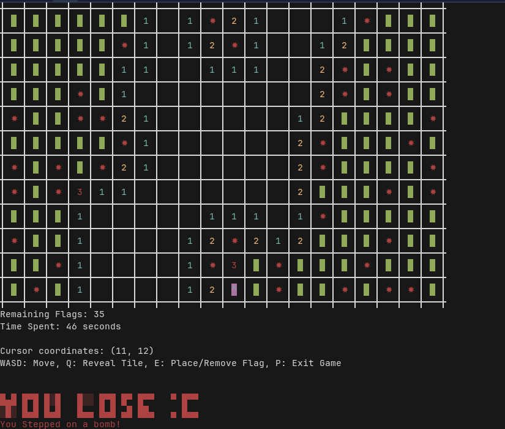

# CLI Sweeper


CLI Sweeper is my attempt of making a multiplayer command-line version of the classic game, Minesweeper.

## Features
* Tested and works well on both linux and windows.
* Uses TCP Sockets to connect players in a server-client setup.

## Gameplay Modes
* Singleplayer: Classic minesweeper.
* Multiplayer: 1v1 minesweeper inspired from the Battleship game. (both players place bombs and proceed to guess where each other's bombs are)

## Demo Video

[](https://www.youtube.com/watch?v=8pwe49-fZ_g)

(click on the image)

## Screenshots



## Project Structure
```
├── README.md
└── src
    ├── client
    │   ├── intro.cpp
    │   ├── main.cpp
    │   ├── minesweeper.cpp
    │   ├── multiplayer.cpp
    │   └── utils.cpp
    ├── include
    │   ├── conio_linux_port.h
    │   └── Menu.h
    └── server
        ├── main.cpp
        └── utils.cpp
```

## Installation

MUST have a C++17 or above compiler and make support.

### Building from source

1. Clone the repository
```bash
git clone https://github.com/leetuah/clisweeper.git
cd CLISweeper
```

2. Compile it using Makefile
```bash
make
```

3. If you are re-compiling the code, clean the code before re-running it using
```bash
make clean
```
## Usage

Note: You must run a multiplayer server if you are attempting to play it.

### 1. Start server (if you are hosting it)
Open a terminal and start the server. It will listen for incoming TCP connections.
```bash
./server # on linux
server.exe # on windows
```

### 2. Start client
Open the terminal and launch the client.
```bash
./client # on linux
client.exe # on windows
```

### 3. Playing Multiplayer
* Host generates a room, with a 5-digit unique room ID.
* Other client joins with the shared room code.
* The host runs the game and the game starts.

## Libraries Used

* [conio for linux](https://github.com/zoelabbb/conio.h): For making keyboard inputs work on linux.
* [Effortless menus](https://github.com/LeeTuah/Effortless-Menus): For generating a nice-looking terminal UI.

## License 
MIT License
